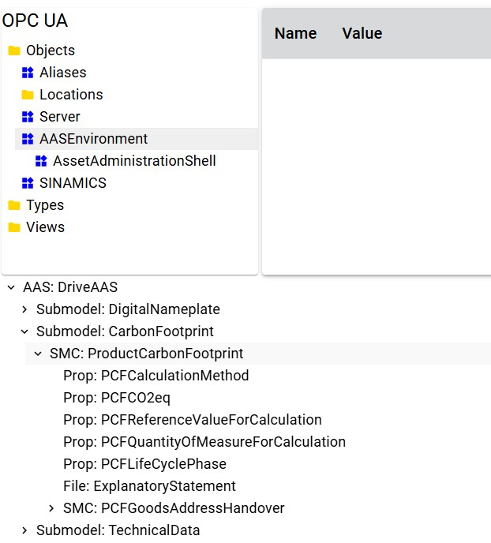

# PoC unifying AAS and OPC UA

The PoC provides the results of the feasibility study conducted by the joint working group of IDTA and OPC Foundation for a common meta-information model and a common web-based communication for AAS and OPC UA.

The development was made simultaneously to the creation of the specifications from the mapping and common communication Subworking Groups. Because of this not all functionalies will be spec conform. 

The following project is part of the repository:
| Project | Description | 
|---|---| 
| [UaWebApiGateway](./UaWebApiGateway/) | A React-TypeScript project, which supports HTTPS and WebSockets to get AAS and OPC UA informations from a common meta-information model. |

## UaWebApiGateway

The base of this project is the [UaWebApiGateway](https://github.com/OPCFoundation/UA-WebApi-StarterKit) from Randy Armstrong. His project can be found on the OPC Foundation Github.

-------------------------------------------------

This PoC project [UaWebApiGateway](./UaRestGateway/UaRestGateway.sln) is a React/TypeScript client that runs in a web browser and supports the basic OPC UA Web API as well as the basic AAS Web API.

The AAS tree is build with reading an aasx file, which contains all informations needed.
For the OPC UA tree, a client connects with a dedicated OPC UA Server and reads its informationmodel.

The communication for reading the data values for AAS or OPC UA ​​is implemented either through REST or WebSockets.  

