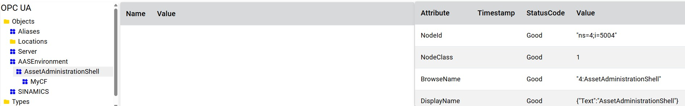
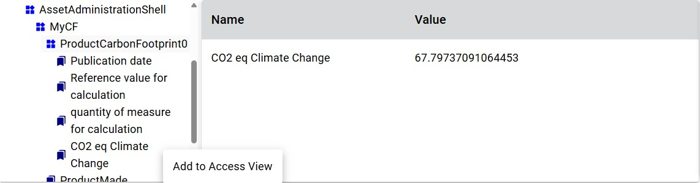
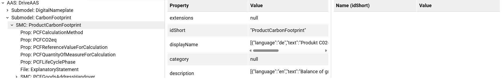
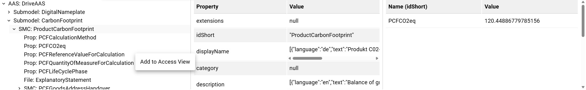
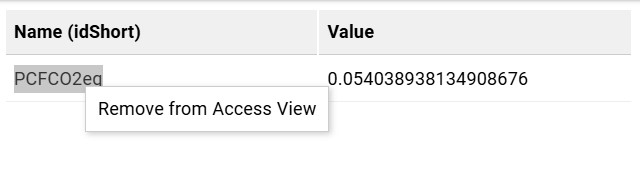
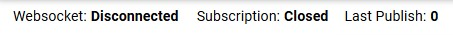
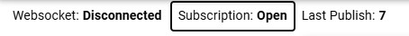
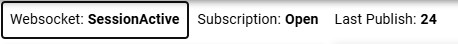
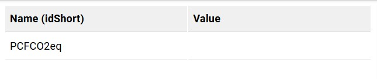

# OPC UA Web API Gateway

## Configuration

This is a technical PoC which brings a few requirements with it.
We also recommend to build a docker, since it's way more stable then a debug build.

### OPC UA Server with common meta model

To read the correct informations for the AAS and OPC UA parts, the OPC UA Server which holds the common meta informationmodel, needs to have a correct nodeset. 

An example nodeset can be found here [nodesets](./nodesets/). 
You need to ensure, that either this nodeset is loaded or if you want to have your own nodeset, you need to make sure, that the mapping for AAS is correct.

### OPC UA client for Web client

The PoC has a OPC UA client to connect to an OPC UA server for reading the values of selected variables.
The server address is hard coded on: "opc.tcp://192.168.56.102:4840". 
You need to make sure, that your OPC UA server which has the common meta model is reachable at this address or if you want to change it, you need to change the configured address in [UAClient.cs](./UaRestGateway.Server/Service/UAClient.cs) line 46.

### Building the docker

To build the docker, you need to have a docker environment on your machine  (for windows this could be: docker desktop on linux you can just install docker with the package manager).
Open a console and navigate to [UaWebApiGateway](./UaWebApiGateway) folder. 
With 
```
docker build -t uawebapigateway-uarestgateway-server .
```
the image can be build.

### Running the docker

Running either on windows or linux, the port *44430* needs to be exposed.

If the docker is running on a windows system, the image can be started and the port exposed via with the UI from the docker desktop.

On linux the docker image can be started with
```
docker run --expose 44430 uawebapigateway-uarestgateway-server:latest
```
## How to use the PoC

The PoC web application is devided into 3 different parts:

* OPC UA
* AAS
* Network message

OPC UA and AAS is again devided into 3 sections:
* Tree view
To browse the OPC UA information model or the Asset Administration Shell.
From here elements can be added to the access view. 
* Access view
Elements from the specific tree.
If the elements are values which are read from OPC UA a subscription will be created.
* Property view
Informations about the element which is selected.

### OPC UA 

The OPC UA view is build like the UAExpert.
This means, on the left side, you can find the OPC UA information model tree, which you can browse through with clicking on the different nodes.
While browsing in the property view on the far right side, the information of the node you selected is shown.




Different to the UAExpert, to add a node to the access view which is the middle element, you need to right click the wanted node or make a double click on it. Drag and Drop is not supported.
A new popup window will appeare which needs to be clicked. With this the node will be added to the access view and a subscription is created if non exists already.



NOTE:
* Only variables are supported for the access view. 
* A subscription will not run automaticly. To start the subscription, the button *Subscription* in the banner menu needs to be pressed.

To remove a element from the access view, you need to click the node inside the access view and the element will be deleted.

### AAS

The AAS view has a similar handling as the OPC UA view. It is devided into 3 different sections.
On the left side you can find the AAS tree view, which you can browse through clicking on the wanted element.
While browsing in the property view in the middle, the information of the selected element is shown.



To add a node to the access view which is on the far right, you need to right click the wanted element or make a double click on it. Drag and Drop is not supported.
A new popup window will appeare which needs to be clicked. With this the node will be added to the access view and a subscription is created if non exists already.



NOTE:
* A subscription will not run automatically. To start the subscription, the button *Subscription* in the banner menu needs to be pressed.

To remove a element from the access view, you need to right click or double click the element inside the access view and press the button in the new popup window.



### Activate subscriptions

A subscription can only be activated, if a node/element in either the OPC UA access view or the AAS access view was added, since only then a subscription with MonitoredItems is created.

If a subscription is created, with the button "Subscription" in the banner menu, the subscription can be activated.



You can see that the subscription is active when the value of the subscription button switches to open.



NOTE:
If you activated the subscription with for example an OPC UA subscription and create later a AAS subscription, you will need to deactivate the subscription and activate it again after adding an AAS element to the access view.

### Change communication to WebSockets

To change the communication from REST to WebSockets, the Button "Websocket" needs to be clicked.
If "Websocket" states: Disconnected the communication done via REST.


If "Websockets" states: SessionActive the communication done via WebSocket



The handling of browsing and adding nodes/elements to the access view works the same.

### Technical PoC limitations / behaviours 

Since it's a technical PoC there are some limitations / behaviours you will not expect.

#### AAS WebSocket - Access View

If you are changing the communication from REST to WebSocket right after the start, and you add an AAS element to the Access View, you will not get the current value of the node. The subscription will still work and the values will be updated.


